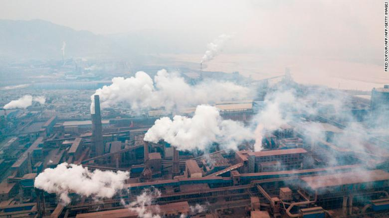

<center>
</center>

```{r include=FALSE}
knitr::opts_chunk$set(comment = NA)
```

#  **Introduction**

Air pollution is a tremendous issue in big cities, where health issues and traffic restrictions are increasing. Some major pollutants such as $PM_{2.5}$, $PM_{10}$, $O_3$, $SO_2$ and $NO_2$ would cause enormous disturbance to environment and threat to human health. In this page, let's analyse a data set containing measures from different air quality stations in China from February 2014 to February 2016, focusing on how is each pollutants distributed, how the presence of them changed along the time, and could we forecast the pollutents in the future?

# **Some Air Pollutant Info**

Here are some quick information about the pollutants mentioned above (You can visit [EPA website](https://www.epa.gov/environmental-topics/air-topics) for more specific information).

* **Ground-level Ozone ($O_3$)** comes from sources such as cars, power plants, industrial boilers, refineries and could cause health problems such as Chest pain, coughing, throat irritation, and airway inflammation.

* **Suspended Particles ($PM_{10}$)** comes from sources such as construction sites, unpaved roads, fields, smokestacks, etc. This pollutant is linked to a number of health problems, including irregular heartbeat,aggravated asthma,decreased lung function.

* **Fine Inhalable Particles ($PM_{2.5}$)** is similar as above but only 2.5 micrometers in diameter, posing the greatest risk to health.

* **Nitrogen Dioxide ($NO_2$)** comes from motor vehicle exhaust,petrol, metal refining and could cause coughing, wheezing or difficulty breathing.

* **Sulphur Dioxide ($SO_2$)** comes from burning of fossil fuels by power plants, and could cause burning sensation in the nose and throat.


# **Data set used**

We are using the dataset named:

>[China AQI Archive (Feb 2014 - Feb 2016)](https://dataverse.harvard.edu/dataset.xhtml?persistentId=doi:10.7910/DVN/GHOXXO): AQI air quality observations from ground monitoring stations in China are collected and stored PostGresql (three times each day). 


# **Prepare Data**

This section will go through the steps needed for preparing our data for analysis.

First, we need to load following needed libraries:
```{r message =FALSE}
# for data wrangling
library(tidyverse)
library(lubridate)

# for plots and interactive map
library(gridExtra)
library(ggplot2)
library(leaflet)
library(RColorBrewer)

# for prediction model
library(caret)
library(plotROC)

```


## **Loading Data**

Then, we need to load the dataset. However, since this dataset contains over 2.5 million observations which takes forever during knitting, I subset the dataset to including ground monitoring stations from 17 major cities and write a new csv, then disable evaluating the following code chunk. Also, there are 3 attributes we don't need, so set them to null.

```{r warning=FALSE, eval=FALSE} 
aqi <- read.csv("aqiobs.csv", 
                       sep=",", fileEncoding="UTF-8")

aqi_select <- aqi %>% filter(str_detect(stationname, "Chengdu$")==TRUE | str_detect(stationname, "Beijing$")==TRUE | str_detect(stationname, "Guangzhou$")==TRUE | str_detect(stationname, "Shanghai$")==TRUE | str_detect(stationname, "Wulumuqi$")==TRUE | str_detect(stationname, "Wuhan$")==TRUE | str_detect(stationname, "Zhengzhou$")==TRUE | str_detect(stationname, "Haerbin$")==TRUE | str_detect(stationname, "Lhasa$")==TRUE | str_detect(stationname, "Changsha$")==TRUE | str_detect(stationname, "Kunming$")==TRUE | str_detect(stationname, "Xian$")==TRUE | str_detect(stationname, "Qingdao$")==TRUE | str_detect(stationname, "Dalian$")==TRUE | str_detect(stationname, "Xiamen$")==TRUE | str_detect(stationname, "Guiyang$")==TRUE | str_detect(stationname, "Hangzhou$")==TRUE) 
  
aqi_select$chinesename <- NULL
aqi_select$rowid <- NULL
aqi_select$unix_time <- NULL

write.csv(aqi_select,'aqi_filtered.csv')

```


## **Looking at the Data**

Now, we read the filtered csv file: 
```{r message=FALSE}
aqi <- read.csv("aqi_filtered.csv", sep=",", fileEncoding="UTF-8")

aqi$X <-NULL

str(aqi)
```

From the above summarization of this dataset, there are 267712 observations, and all of the pollutant attributes and temperature, dewpoint, humidity, station name and wind are in factor types. We also can see there are levels of these measures looks like "" and "-" which should be regarded as NA.


Following is a dictionary of the data including the units of the measures which is important (because when we want to determine what level of pollutants considered unhealthy is related to units):

<center>

| Name | Description/Unit             |
|------|------------------------------|
| `LocatID` | Location ID generated by unique latitude-longitude pairs for each monitor location |
| `StationName` | Station Name as defined by the monitor owner  (might change, might not be unique |
| `Latitude` | Latitude North in decimal degrees WGS84 |
| `Longitude` |  Longitude East in decimal degrees WGS84 |
| `PM2.5` | Particulate Matter 2.5 micron diameter  $µg/m^3$ (micrograms per cubic metre) |
| `PM10` |  Particulate Matter 10 micron diameter  $µg/m^3$ (micrograms per cubic metre) |
| `O3` | Ozone   pphm (parts per hundred million) |
| `NO2` | NOX  NitrogenDioxide   pphm (parts per hundred million) |
| `SO2` | SOX  SodiumDioxide  pphm (parts per hundred million) |
| `CO` | CarbonMonoxide  ppm (parts per million) |
| `Temperature` | Degrees Celsius |
| `DewPoint` |  Temperature to which air must be cooled to become saturated with water vapor degrees Celsius |
| `Pressure` | Millibars |
| `Humidity` | Absolute humidity in grams/meter3 |
| `Wind` | km / hour |
| `Est_time` | Eastern time|

</center>


Showing head of the data below:

```{r}
head(aqi, n=15)
```

By looking at the shown data above, we can notice that the est_time attributes is a double type, which is not a convenient datetime type, thus we also need to convert that. Then we come to the next section: tidying the data.

## **Tidying the Data**

First, we need to handle some missing data. The observation of pm2.5 and pressure cannot be 0 then they are also considered as missing values. Using the following code to encode them as NA.

Then we need to convert each column to the appropriate data type, station name should be a character type, and all measurements converted to integer type. Also, because I focus on the monthly change of pollutants, the following code extract the year and month of the Eastern time values and convert it to datetime type.

Finally, we need to impute the missing data by using the mean of non-missing values since it won't change the mean.


```{r }
# encode NA
aqi <- aqi %>% 
  filter(pm25 != "0" & pm25 != "" & pm25 != "-" ) %>%
  mutate_all(funs(replace(.,str_detect(.,"^-$"),NA))) %>%
  mutate_all(funs(replace(.,str_detect(.,"NA"),NA))) %>%
  mutate_all(funs(replace(.,str_detect(.,"^$|^ $"),NA))) %>%
  naniar::replace_with_na(replace = list(pressure = 0)) %>%
  replace_na(list(pressure=median(.$pressure, na.rm=TRUE)))

# type convert
aqi$stationname <- as.character(aqi$stationname)

aqi$pm25 <- as.integer(aqi$pm25)
aqi$pm10 <- as.integer(aqi$pm10)
aqi$o3 <- as.integer(aqi$o3)
aqi$no2 <- as.integer(aqi$no2)
aqi$so2 <- as.integer(aqi$so2)
aqi$co <- as.integer(aqi$co)
aqi$temperature <- as.integer(aqi$temperature)
aqi$dewpoint <- as.integer(aqi$dewpoint)
aqi$pressure <- as.integer(aqi$pressure)
aqi$humidity <- as.integer(aqi$humidity)
aqi$wind <- as.integer(aqi$wind)


aqi$est_time <- as.character(aqi$est_time)
aqi$est_time <-str_extract(aqi$est_time,"^[:digit:]{6}")

# impute NA
aqi <- aqi %>%
  type_convert(col_types = cols(est_time = col_datetime(format = "%Y%m"))) %>%
  tidyr::replace_na(list(wind=mean(.$wind, na.rm=TRUE),pm25=mean(.$pm25, na.rm=TRUE), pm10=mean(.$pm10, na.rm=TRUE), o3=mean(.$o3, na.rm=TRUE), no2=mean(.$no2, na.rm=TRUE), so2=mean(.$so2, na.rm=TRUE), co=mean(.$co, na.rm=TRUE), temperature=mean(.$temperature, na.rm=TRUE), humidity=mean(.$humidity, na.rm=TRUE), pressure=mean(.$pressure, na.rm=TRUE)))


str(aqi)
```

Now, by seeing the summary above, all of the columns are in their appropriate data type and the est_time only contains information of year and month.

Next, convert the dataset to a set that tracking the monthly average pollutant measurements by grouping each stations and their corresponding year-month time then extract means and other needed attributes such as location coordinates and station name.

```{r}
aqi_month <- aqi %>%
   group_by(locationid,est_time) %>%
  summarize(pm25= mean(pm25, na.rm = TRUE), pm10=mean(pm10,na.rm = TRUE), o3=mean(o3,na.rm = TRUE), no2=mean(no2,na.rm = TRUE), so2=mean(so2,na.rm = TRUE), co=mean(co,na.rm = TRUE), temperature=mean(temperature,na.rm = TRUE), pressure=mean(pressure,na.rm = TRUE), humidity=mean(humidity,na.rm = TRUE), wind=mean(wind,na.rm = TRUE), stationname= first(stationname), latitude= first(latitude), longitude=first(longitude)) 


aqi_month
```

Now we have a data table contains average monthly pollutant measurements.

# **Exploratory Data Analysis**

This section wiil show the process for doing some visualization of our data.

## **Interactive Map**
Interactive Map is a useful visualization for Geographic data. For our data, each station has a location coordinates which enable us to visualize the distribution of data on a map.

Following are steps for making a two layer interactive map that showing the average level of health impact of PM2.5 and PM10 distributions for all stations among 17 cities during year 2014 to 2016.

### **Prepare Data Again**

First, we need to process our data in order to fit our desired functionality of the map.

Following chunk groups the data by the unique station location ID to calculate the average measurements values during year 2014 to 2016.

```{r}
aqi_formap <- aqi %>%
  group_by(locationid) %>%
  summarize(pm25= mean(pm25, na.rm = TRUE), pm10=mean(pm10,na.rm = TRUE), o3=mean(o3,na.rm = TRUE), no2=mean(no2,na.rm = TRUE), so2=mean(so2,na.rm = TRUE), co=mean(co,na.rm = TRUE), temperature=mean(temperature,na.rm = TRUE), pressure=mean(pressure,na.rm = TRUE), humidity=mean(humidity,na.rm = TRUE), wind=mean(wind,na.rm = TRUE), stationname= first(stationname), latitude= first(latitude), longitude=first(longitude))
```


Then, the following table shows the ranges corresponding to different values of PM2.5 and PM10 and their resulting health impact ([Ref](https://www.airveda.com/blog/Understanding-Particulate-Matter-and-Its-Associated-Health-Impact)).

<center>

| Quality         | $PM_{2.5}\;  (\mu g/m^3)$ | $PM_{10}\;  (\mu g/m^3)$ |
|-----------------|---------------------------|--------------------------|
| Good            |       $0-30$              |       $0-50$             |
| Moderate        |      $31-60$              |      $51-100$            |
| Unhealthy for Sensitive Groups |      $61-90$              |      $101-250$           |  
| Unhealthy       |       $91-120$            |      $251-350$           | 
| Very Unhealthy  |     $121-250$             |      $351-430$           |
| Hazardous       |     $>=251$               |       $>=431$            |

</center>

Thus we need to encode the PM2.5 and PM10 into their corresponding levels, following code chunk shows encoding for PM10, levels for PM2.5 will be encoded when adding markers to map.

```{r}
aqi_formap<- aqi_formap %>%
  mutate(pm10Cat = case_when(pm10>=0 & pm10 <=50 ~ 1, pm10 >=51 & pm10 <=100 ~ 2,
                                pm10 >=101 & pm10 <=250 ~ 3,
                                pm10 >=251 & pm10 <=350 ~ 4,
                                pm10 >=351 & pm10<=430 ~ 5,
                                pm10>= 431 ~ 6,
                            TRUE ~ NA_real_)
         )%>% filter(!is.na(pm10Cat))

aqi_formap
```


### **Implement the Map**

The following code shows how to add ground monitoring station markers for PM10 and PM2.5 which are differed by colors indicating the levels of health impact. 


First, set the map view according to latitudes and longitudes of China:
```{r}
aqi_map <- leaflet(aqi_formap) %>%
  addProviderTiles(providers$OpenStreetMap.DE) %>%
  setView(lat=39.91, lng= 116.36, zoom=4)
```


Then set marker popup information, encode different colors, and set icons information for PM2.5 levels:
```{r}
content <- paste("<b>Station: </b> ", aqi_formap$stationname, "<br>",
                 "<b>Humidity: </b> ", aqi_formap$humidity, "<br>",
                 "<b>Temperature: </b> ", aqi_formap$temperature, "<br>",
                 "<b>O<sub>3</sub>: </b> ", aqi_formap$o3, "<br>", 
                 "<b>SO<sub>2</sub>: </b> ", aqi_formap$so2, "<br>",
                 "<b>NO<sub>2</sub>:  </b>", aqi_formap$no2, "<br>",
                 "<b>PM<sub>2.5</sub>:  </b>", aqi_formap$pm25, "<br>",
                 "<b>PM<sub>10</sub>:  </b>", aqi_formap$pm10, "<br>")

getColor <- function(aqi_formap) {
  sapply(aqi_formap$pm25, function(pm25) {
  if(pm25 <= 30) {
    "green"
  } else if(pm25 <= 60) {
    "yellow"
  } else if (pm25 <= 90) {
    "orange"
  }
    else if (pm25 <= 120) {
    "pink"
  }
    else if (pm25 <= 250) {
    "purple"
  }
    else {
    "red"
  } })
}

icons <- awesomeIcons(
  icon = 'ios-close',
  iconColor = 'black',
  library = 'ion',
  markerColor = getColor(aqi_formap)
)

```


Then we add markers for PM2.5:
```{r}
aqi_map <- aqi_map %>%
  addAwesomeMarkers(data=aqi_formap,lng=aqi_formap$longitude, lat=aqi_formap$latitude, icon=icons,popup = content, group= 'PM2.5') %>%
  addLegend(position = 'bottomright', colors= c("green","yellow","orange", "pink","purple", "red"), labels=c("Good", "Moderate", " Unhealthy for Sensitive Groups", "Unhealthy", "Very Unhealthy", "Hazardous"), title='Different PM2.5 Level', group= 'PM2.5')
```


Then encode colors for levels of PM10 and add circle markers for PM10:
```{r}

cols <- brewer.pal(6,name='RdYlBu')
pm10.col <-colorFactor(cols,
                  domain = aqi_formap$pm10Cat)

aqi_map <- aqi_map %>%
  addCircleMarkers(data=aqi_formap,lng=aqi_formap$longitude, lat=aqi_formap$latitude, color=pm10.col(aqi_formap$pm10Cat),popup = content, group= 'PM10') %>%
  addLegend(position = 'bottomleft', colors= cols, labels=c("Unhealthy", "Moderate", "Very Unhealthy", "Unhealthy for S", "Good", "Hazardous"), title='Different PM10 Level', group= 'PM10')
```


Finally, we need to create layers corresponding to the group argument from above addMarkers functions and hide PM10 group for clear visual:
```{r}
aqi_map <- aqi_map %>%
  addLayersControl(overlayGroups=c('PM2.5','PM10'),
                      options = layersControlOptions(collapsed = F, autoZIndex =
                                        T)) %>% hideGroup("PM10")

aqi_map
```

>  Insight: Extend layers to other pollutants and use different sized markers?

Now, let's look at the interactive map above. First, look at the layer displaying PM2.5 distribution across all monitoring stations, we could find that many cities are in the level of <span style="color:red">Hazardous</span> and some cities are in the level of <span style="color:purple">Very Unhealthy</span>. And find that cities around the country borderline experience worse PM2.5 circumstances than inland cities.

Then, look at the layer displaying PM10 distribution across all monitoring stations, the level of health impact of PM10 seems spreaded equally into 3 categories: <span style="color:#CD5C5C">Unhealthy</span>, <span style="color:#F0E68C">Very Unhealthy</span>, and <span style="color:#4169E1">Hazardous</span>. Cities in the south part of China seems experience a little bit better situation for PM10 issues.

Thus it seems the case that the issue of PM2.5 is worse than the issue of PM10 in the 17 cities in China.

## **Plot Visualization**

This section will show some plots for analysizing the data.

### **Histograms for PM2.5 and PM10**

From the previous section, it seems like that the issue of PM2.5 is worse than the issue of PM10, but not clear how worse is the issue of PM2.5 comparing to that of PM10.

Thus, for this section, we are going to do some visualization that could help us conclude how issue of PM2.5 is worse than PM10.

First, recall the table showing ranges corresponding to different values of PM2.5 and PM10 and their resulting health impact. 

<center>

| Quality         | $PM_{2.5}\;  (\mu g/m^3)$ | $PM_{10}\;  (\mu g/m^3)$ |
|-----------------|---------------------------|--------------------------|
| Good            |       $0-30$              |       $0-50$             |
| Moderate        |      $31-60$              |      $51-100$            |
| Unhealthy for Sensitive Groups |      $61-90$              |      $101-250$           |  
| Unhealthy       |       $91-120$            |      $251-350$           | 
| Very Unhealthy  |     $121-250$             |      $351-430$           |
| Hazardous       |     $>=251$               |       $>=431$            |


</center>

We will make histograms of PM2.5 and PM10 to see what are the values of them distributed.

The following code makes histograms which have shaded rectangular to indicate the health impact level for corresponding range of PM2.5 or PM10 values. Specifically, 
partition ranges into 2 new categories: <span style="color:orange">"Good to Unhealthy"</span> and <span style="color:red">"Very Unhealthy to Hazardous"</span> and shade the categories on the histograms.

```{r warning= FALSE}
 aqi_month %>%
  ggplot(aes(x=pm25)) +
  geom_rect(aes(xmin=0, xmax=720, ymin=-Inf, ymax=Inf), fill="orange", alpha=0.01) +
  annotate('text', x=95, y=170, label="Good~to~Unhealthy", parse=TRUE, size=3) +
  annotate('text', x=95, y=165, label=expression("0-120"~mu*g/m^3), parse=TRUE, size=3) +
  geom_rect(aes(xmin=121, xmax=720, ymin=-Inf, ymax=Inf), fill="red", alpha=0.01) +
  annotate('text', x=480, y=170, label="Very~Unhealthy~to~Hazardous", parse=TRUE, size=3) +
  annotate('text', x=480, y=165, label=expression(">=121"~mu*g/m^3), parse=TRUE, size=3) +
  geom_histogram(binwidth=15) +
  labs(x="PM2.5(ug/m^3)", y="Count", title= "Histogram of PM2.5") 

 aqi_month %>%
  ggplot(aes(x=pm10)) +
  geom_rect(aes(xmin=0, xmax=700, ymin=-Inf, ymax=Inf), fill="orange", alpha=0.01) +
  annotate('text', x=250, y=260, label="Good~to~Unhealthy", parse=TRUE, size=3) +
  annotate('text', x=250, y=240, label=expression("0-350"~mu*g/m^3), parse=TRUE, size=3) +
  geom_rect(aes(xmin=351, xmax=700, ymin=-Inf, ymax=Inf), fill="red", alpha=0.01) +
  annotate('text', x=580, y=260, label="Very~Unhealthy~to~Hazardous", parse=TRUE, size=3) +
  annotate('text', x=580, y=240, label=expression(">=350"~mu*g/m^3), parse=TRUE, size=3) +
  geom_histogram(binwidth=15) +
  labs(x="PM10(ug/m^3)", y="Count", title= "Histogram of PM10")

```

Looking at the above 2 histograms, the histogram of PM2.5 shows the distribution seems centered largely on 200 to 500, which are corresponds to <span style="color:red">"Very Unhealthy to Hazardous"</span> category, which means majority of cities experience severe PM2.5 issue. Then the histogram of PM10 is kind of left skewed, showing that PM10 is also an issue.

Comparing this 2 histograms, we could find that the red shaded area takes much more significant portion in the PM2.5 histogram than that of PM10 histogram, and that red shaded area corresponding to <span style="color:red">"Very Unhealthy to Hazardous"</span> category. Thus, we can observe that the issue of PM2.5 is significantly worse than the issue of PM10.


### **Visualization for Chengdu City**

As a citizen of Chengdu, I'm interested in how different pollutants change across time and are there differences among the 7 different stations in Chengdu for a same pollutant monitored. So this section will show the process for visualization of the data related to my concerns.

#### **Line Plots for PM2.5 and PM10**

First, make 2 line plots for showing chaanges of PM2.5 and PM10 (because these 2 pollutant measured in same unit) across by time and grouped by different monitoring stations in Chengdu.
```{r}
plot1<-aqi_month %>% 
  filter(str_detect(stationname,"Chengdu$") == TRUE) %>%
  ggplot(aes(x = est_time, y = pm25, color= as.factor(locationid))) +
           geom_point(alpha=0.2) + geom_line(aes(group = as.factor(locationid))) + theme_light() + theme(legend.position = "top") +
   xlab("Time") +
  ylab("PM2.5") +
  ggtitle("PM2.5 across Time")

plot2<- aqi_month %>% 
  filter(str_detect(stationname,"Chengdu$") == TRUE) %>%
  ggplot(aes(x = est_time, y = pm10, color= factor(locationid))) +
           geom_point(alpha=0.2) + geom_line(aes(group = as.factor(locationid))) + theme_light() + theme(legend.position = "top") +
   xlab("Time") +
  ylab("PM10") +
  ggtitle(expression(PM[10]~across~Time))

grid.arrange(plot1, plot2, layout_matrix=rbind(c(1),
                                               c(2)))
```

Look at these 2 line plots above, we can notice that PM2.5 monitored in Chengdu seems get to a peak during the summer and fall of 2014 and decline, then get another peak around the summer and fall of 2015, then decreasing as the winter comming. Also, notice that <span style="color:#FF1493">station#152</span> has more dramatic changes across the time than other stations.

Then look at the PM10 plot, we can see that it has slightly more steady changes across time comparing to PM2.5. And it seems that changes of PM10 among different stations have similar variation tendency across the time. They all have a relative min point at around Jan. 2015 and seems to increase till Jan. 2016 except one station: <span style="color:green">station#148</span>. 

#### **Line Plots for $O_3$, $NO_2$ and $SO_2$**

Then, how about the change of other 3 gas or liquid pullutants which are measured in same unit $pphm$ ($O_3$, $NO_2$ and $SO_2$)? The following code shows the line plot of $O_3$, $NO_2$ and $SO_2$ change across time.
``` {r warning= FALSE}
plot3<- aqi_month %>% 
  filter(str_detect(stationname,"Chengdu$") == TRUE) %>%
  ggplot(aes(x = est_time, y = no2, color= factor(locationid))) +
           geom_point(alpha=0.2) + geom_line(aes(group = as.factor(locationid))) + theme_light() + theme(legend.position = "top") +
   xlab("Time") +
  ylab("NO_2") +
  ggtitle(expression(NO[3]~across~Time))


plot4<- aqi_month %>% 
  filter(str_detect(stationname,"Chengdu$") == TRUE) %>%
  ggplot(aes(x = est_time, y = o3, color= factor(locationid))) +
           geom_point(alpha=0.2) + geom_line(aes(group = as.factor(locationid))) + theme_light() + theme(legend.position = "top") +
   xlab("Time") +
  ylab("O_3") +
  ggtitle(expression(O[3]~across~Time))

plot5<- aqi_month %>% 
  filter(str_detect(stationname,"Chengdu$") == TRUE) %>%
  ggplot(aes(x = est_time, y = so2, color= factor(locationid))) +
           geom_point(alpha=0.2) + geom_line(aes(group = as.factor(locationid))) + theme_light() + theme(legend.position = "top") +
   xlab("Time") +
  ylab("SO_2") +
  ggtitle(expression(SO[2]~across~Time))


grid.arrange(plot3, plot4, plot5, layout_matrix=rbind(c(1,1,2,2),
                                                      c(NA,3,3,NA)))

```

From the 3 plots above, we can observe that for all 3 different pollutants, different stations seems have different variation trend of pollutant during some time period or during the whole 2-year period. For example, $O_3$ seems have similar trend among different stations during the time before Autumn 2015, but differd from each other during the subsequent time.

#### **Bar Plots for $O_3$, $NO_2$ and $SO_2$**

Finally, let's compute the pollutant($O_3$, $NO_2$ and $SO_2$) mean values for each monitoring station in Chengdu and visualize them using a bar plot.

``` {r}
aqi_month %>% 
  filter(str_detect(stationname,"Chengdu$") == TRUE)  %>%
  filter(stationname != "Chengdu") %>%
  group_by(stationname) %>%
  summarize(Mean.NO2=mean(na.omit(no2)),
            Mean.O3=mean(na.omit(o3)),
            Mean.SO2=mean(na.omit(so2))) %>%
  gather(Measure, Value, 2:4) %>%
  mutate(Station=factor(stationname, levels=c("Jinquan lianghe, Chengdu", "Shilidian, Chengdu",
                                          "Sanwayao, Chengdu", "Shahepu, Chengdu",
                                          "Liang Lane, Chengdu", "Caotang Temple, Chengdu", 
                                          "Lingyansi, Chengdu"))) %>%
  ggplot(aes(x=Station, y=Value, fill=Measure)) +
  geom_col(position=position_stack(reverse=FALSE),  colour="black") + 
  geom_text(aes(label=round(Value, digits=2), group=Measure), position=position_stack(vjust=0.5)) +
  theme_bw() +
  coord_flip() +
  labs(x="Station", y="pphm", title="Mean values by station") +
  theme(legend.title=element_blank(),
        legend.position="bottom") +
  scale_fill_discrete(breaks=c("Mean.NO2", "Mean.O3", "Mean.SO2"),
                      labels=c(expression(NO[2]), 
                               expression(O[3]),
                               expression(SO[2])))

```

From the bar plot above, different stations have similar differences among the mean values of <span style="color:#228B22">$O_3$</span>, <span style="color:#FF6347">$NO_2$</span> and <span style="color:#4169E1">$SO_2$</span>. It is that there are more <span style="color:#228B22">$O_3$</span> monitored in Chengdu than the other two, and <span style="color:#4169E1">$SO_2$</span> slightly more than <span style="color:#FF6347">$NO_2$</span>.


# **Random Forest Prediction**

In this section, we are going to answer this question: can a simple random forest implementation predict whether the monthly mean PM2.5 among stations in all 17 cities will increase or decrease in the next month? 

Following will show how we implement random forest and whether it is a good prediction.

## **Data Preparation** {.tabset .tabset-fade .tabset-pills}

First, we need to make an outcome data frame that encoding the difference as up or down for the variation of PM2.5 between Dec.2015 and Jan.2016 for all stations in the 17 cities in our dataset. And then use data up to 2015 for the random forest classifier.

### Outcome data frame
```{r}
outcome_df <- aqi_month %>% 
   drop_na() %>%
   mutate(ym = month(est_time)+year(est_time)*1000) %>%
   filter(ym %in% c("2015012", "2016001")) %>%
   select(locationid, stationname, ym, pm25) %>%
   spread(ym, pm25) %>%
   mutate(diff = `2016001` - `2015012`) %>%
   mutate(Direction = ifelse(diff>0, "up", "down")) %>%
   select(locationid,stationname, Direction)

outcome_df
```

### Predictor data frame
```{r}
predict_df <- aqi_month %>%
  drop_na() %>%
  filter(year(est_time) <= 2015) %>%
  group_by(locationid) %>%
  ungroup()

predict_df
```

## **Table Needed for Training**

Then, we need to create a data frame for training. The following code spread the PM2.5 monitored values corresponding to each month during Feb.2014 to Dec.2015 for each stations.

```{r}
wide_df <- predict_df %>%
  select(locationid, est_time, pm25) %>%
  tidyr::spread(est_time, pm25) %>%
  drop_na()

wide_df

```

Now we can create a data frame for training by inner joining the spreaded dataset to corresponding expected outcomes of changes of the PM2.5 in each of total 120 stations.

```{r warning= FALSE}
matrix <- wide_df %>%
  select(-locationid) %>%
  as.matrix()

tmp_df <- matrix%>%
  magrittr::set_colnames(NULL) %>%
  as_data_frame() %>%
  mutate(locationid= wide_df$locationid)
  
df <- tmp_df %>%
  inner_join(outcome_df %>% select(locationid, Direction), by="locationid") %>%
  mutate(Direction=factor(Direction, levels=c("down", "up")))

df


```

## **5-fold cross validation for training**

After we have the data frame needed for training, we are going to use 5-fold cross validation (because of relatively small size of data) to determine including how many mtry(number of variables available for splitting at each tree node) should be set then giving a relatively good prediction.

First, we get the train index of the list with elements for each resampling iteration, and then passing it to the trainControl function. Then, we train our data using 10 as the argument of the ntree (number of trees to grow) parameter.

``` {r}

set.seed(1234)

cv_partition <- createFolds(df$Direction,
                            k=5, returnTrain = TRUE)

fit_control <- trainControl( 
  method = "cv",
  number = 5,
  index = cv_partition,
  summaryFunction=twoClassSummary,
  classProbs=TRUE,
  savePredictions=TRUE)


rf_fit <- train(Direction~.,
                    data= df,
                    method = "rf",
                    ntree = 10,
                    trControl = fit_control,
                    metric="ROC")

rf_fit
```

From the training above, the final value used for the model was mtry = 24, then we plot the ROC graph to analysize AUROC of this model.

```{r warning= FALSE}

roc_df <-
  rf_fit$pred %>%
    filter(mtry == 24)

roc_df %>%
  ggplot(aes(m=up,
             d=factor(obs, levels=c("down","up")))) +
    geom_roc(n.cuts=0) +
    coord_equal() +
    style_roc() 

```

We can observe that the the ROC curve for this model is not further from the digonal line which means the test is less accurate and is a relatively poor test. That maybe because this is a very simple random forest training withouting tuning much parameters, and also might because the variation of PM2.5 across time is not suitable for random forest model. Alternatively, time series algorithms like ARIMA & ETS might be better for our data. However, this might take another whole page for analysis, then will not be shown in this page. But the following links are good sources to learn more about time series analysis.

>[A Little Book of R for Time Series](https://a-little-book-of-r-for-time-series.readthedocs.io/en/latest/)

>[ARIMA Model for Forecasting in R](http://r-statistics.co/Time-Series-Forecasting-With-R.html)


# **Conclusion**

We have analysized that the air pollution was a tremedous issue for the 17 cities in China, and random forest might not be a good model for forecasting the pollutants in the future time. Also, this is a big dataset which there could be other question worth analyzing such as does air pollution affect pressure, humidity or dewpoint? 

# **References**

>[Guide for Replacing values with NA](https://cran.r-project.org/web/packages/naniar/vignettes/replace-with-na.html): Explaining all NA related functions usage.


>[Stringr Cheatsheet](http://edrub.in/CheatSheets/cheatSheetStringr.pdf): Guide for regular expression which are very helpful when you scrape data and then parse the useful information.

>[Leaflet for R](https://rstudio.github.io/leaflet/): Walk through things needed for interactive map.

>[Ggplot2: Elegant Graphics for Data Analysis](http://www.ievbras.ru/ecostat/Kiril/R/Biblio_N/R_Eng/Wickham2016.pdf): Guide for using ggplot2 library

>[R Markdown: The Definitive Guide](https://bookdown.org/yihui/rmarkdown/): Including information about Rmd with HTML and knitr.

>[Random Forest](http://www.hcbravo.org/IntroDataSci/projects/bonus_project/classification_zillow/): How to implement random forest classifier in R.